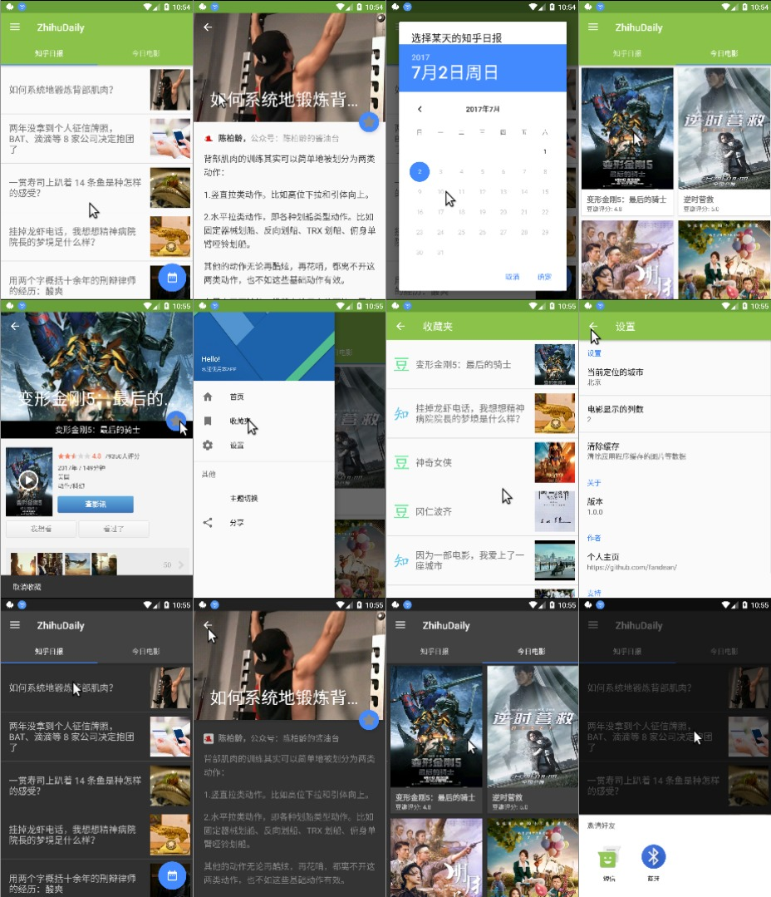

# ZhihuDaily

每日知乎日报和每日最新豆瓣电影的查看和收藏。

## 使用到的库

- 使用Glide实现图片加载;
- 采用Gson解析Json数据;
- 使用Retrofit2.3 + OkHttp3请求网络数据和实现数据缓存;
- Butterknife对View进行注入
- 使用高德地图定位SDK，进行定位（位置信息用于获取当地正在上映的电影）

## 实现的功能

- RecycleView无限滚动（上拉加载）

另见：[项目笔记](./项目笔记.md)

## 演示

## TODO

- [x] CardView的点击效果还没有实现。
- [x] 设备配置变更后，回到之前的列表位置。使用保留fragment对象的方法解决。
- [x] 层级导航，重建Activity问题
- [x] 收藏夹排序问题，数据表中添加自动增长的主键，读取时倒序读取， 并在读取时考虑使用分页读取。
- [x] 豆瓣列表的分页读取，每次读取显示10个项目。 略，因为实现了网络缓存。
- [x] WebView加载css
- [x] 优化Glide图片加载
- [x] 设置界面功能：删除缓存功能：删除Retrofit，和WebView的缓存
- [x] toolbar字体颜色问题
- [x] 加入高德地图的定位功能。[示例中心 | 高德开放平台](http://lbs.amap.com/dev/demo "示例中心 | 高德开放平台")
- [ ] 夜间模式
- [ ] TabLayout在水平布局时，两个tab紧靠在一起
- [ ] 在代码中更改RecyclerView item的高度